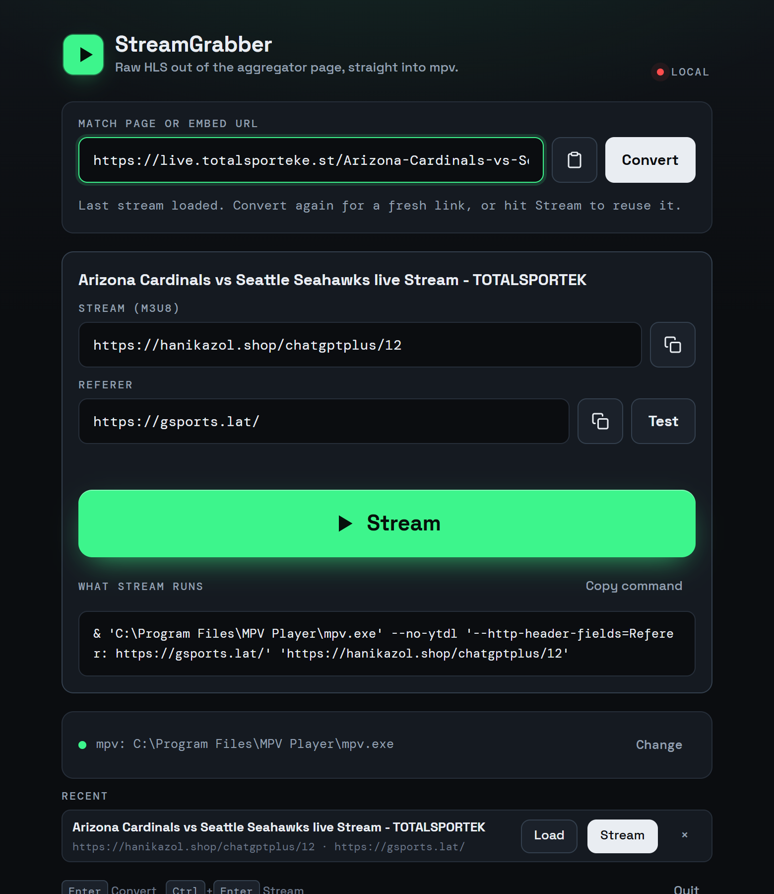

# StreamGrabber


Paste a live-sport aggregator match link, click Convert, click Stream. mpv opens with the raw HLS feed and none of the page around it. No ads, no popunders, no browser tab.



## Download

Grab `StreamGrabber.exe` from the [latest release](../../releases/latest) and run it. It needs two things that are almost certainly already on your machine:

- **mpv.** `winget install mpv` if you don't have it. The app finds it in the usual install spots and on PATH, or you can point it at `mpv.exe` in the footer.
- **Microsoft Edge or Google Chrome.** StreamGrabber drives one of them headlessly to read the match page. Edge ships with Windows, so this is normally nothing to do.

Windows SmartScreen will warn on first run because the exe isn't code-signed. Click "More info", then "Run anyway".

## Using it

1. Paste the match page link (or an embed page link; both work) and press Enter or Convert. The Paste button reads your clipboard and converts in one click. The log under the box shows what the resolver is doing.
2. The stream URL and the referer land in two editable fields with copy buttons. A badge says whether the manifest verified.
3. Stream. mpv opens. The exact command line that ran is shown under the button and can be copied.

Ctrl+Enter streams from anywhere on the page. Test fetches the manifest with the current referer and tells you what came back, which is the first thing to check when mpv opens and closes again.

Before a game the player site usually has nothing up yet: either its event page is down or the stream slot answers 404. The app says which, and offers **Watch for kickoff**. That retries every minute and starts mpv by itself the moment the stream appears, so you can paste the link early and walk away.

The last stream and the seven before it stay in the Recent list, so a game can be restarted without touching the aggregator page again. That helps when the page is down or the ads are worse than usual. Settings live in `%LOCALAPPDATA%\StreamGrabber\config.json`.

Closing the window quits the app. There is no console; if something goes wrong at startup, `%LOCALAPPDATA%\StreamGrabber\streamgrabber.log` has the details, and `StreamGrabber.exe --console` keeps a terminal open.

## How it works

Those match pages wrap a player from another site in an iframe, and that player pulls an HLS manifest whose URL is scrambled in an inline script. The manifest host only answers properly when the request says it came from the player site. StreamGrabber loads the page in a headless browser, watches the network for the manifest, notes which site requested it, and hands both to mpv:

```
& 'C:\Program Files\MPV Player\mpv.exe' --no-ytdl '--http-header-fields=Referer: https://player-site/' 'https://host/path/to/stream'
```

Nothing is hardcoded to a particular site. The resolver tries, in order:

1. Network capture across every frame: a response with an HLS content type, an `.m3u8` URL, or a body starting with `#EXTM3U`.
2. Poke the player (video element, play buttons, the iframe itself) and keep watching.
3. Decode inline scripts. Each one runs in a sandboxed VM where hls.js, jwplayer, video.js and `<video>.src` are stubs that record whatever URL they are handed. A brute-force pass also tries hex, base64 and single-byte XOR for every key.
4. Verify the manifest with the referer. If it comes back truncated, try the other candidate origins, then no referer, and warn if none work.

Ad hosts are blocked, popunders are closed as they open, and images, fonts and media are skipped so the page loads fast. A convert takes three to six seconds.

## When it fails

- **No player iframe was found**: the link is probably the site home or a listing, not a match page. Paste the match page, or the embed page directly.
- **The player page is down (404)**: the player site takes event pages down outside the game window. Nothing to grab yet. Turn on Watch for kickoff.
- **Not live yet**: the stream slot was found but the host has nothing there. Same answer: Watch for kickoff.
- **Loaded but never fetched a manifest**: the site changed its player, or the stream is gone. Convert again; if it keeps happening, open an issue with the log.
- **Manifest did not verify**: the host wants a different referer. Edit the Referer field and press Test until it reports a complete manifest.
- **mpv not found**: `winget install mpv`, or set the path in the footer.
- **No Chromium-based browser found**: install Edge or Chrome, or set `STREAMGRABBER_BROWSER` to the path of any Chromium exe.

## Running from source

```
npm install
npm start
```

Node.js 18 or newer. `StreamGrabber.cmd` does the same with a first-run install. From the terminal, `node resolve.js <url>` prints the stream URL and referer as JSON and nothing else.

## Building the exe

```
npm run build
```

That bundles Node, the app and playwright-core into `dist/StreamGrabber.exe` with pkg, then stamps the icon and version info. `npm run icon` re-renders `icon.ico` from the SVG in `tools/make-icon.js`.

## Layout

- `server.js` local HTTP server, config, mpv launch, the app window
- `resolver.js` the page-to-manifest logic
- `browsers.js` finds Edge, Chrome or a cached Chromium
- `resolve.js` CLI wrapper
- `public/` the UI, one HTML file plus fonts (Space Grotesk and DM Mono, both SIL OFL)
- `tools/` icon and exe build scripts

MIT licensed.
